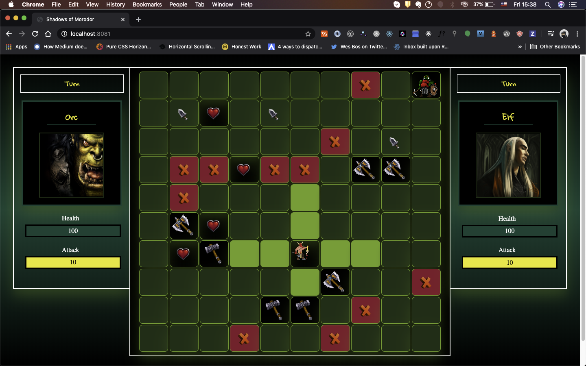
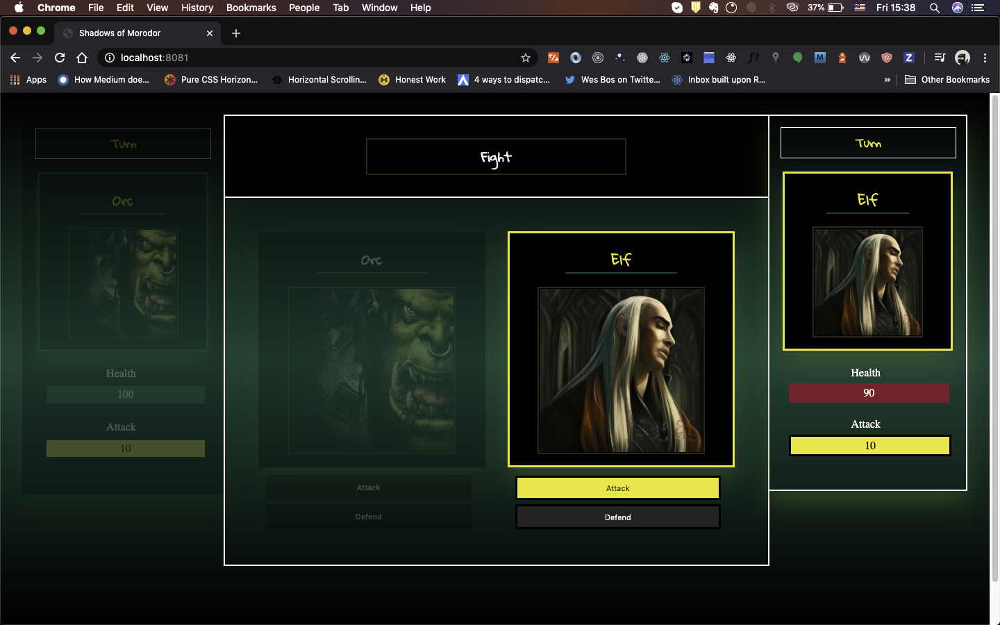

# Shadows of Mordor
A JavaScript turn-based board game where players move across the board two steps at most in either a vertical or a horizontal direction. 
Players collect weapons in preparation for a fight and start fighting when they land on adjacent cells.  

## Overview
The game consists of the following two modes
- Fight Mode
- Map Mode

### Map Mode
Players move across cells and collect weapons whilst avoiding obstacles.

### Fight Mode
Players take turns in either attacking or defending.
#### Attack 
Players attack and damage is inflicted on opponent.
#### Defense
Players sustain 50% damage in the next turn when they choose to defend.

### Features
- Game map consisting of cells players could move across.
- Horizontal and vertical movements of players across the board.
- Fight sequence

### Gameplay
- Players can take vertical or horizontal 2 steps across empty cells.
- Players collect weapons by landing on cells that contain weapons.
- Players enter fight mode when they land on adjacent cells.

### Live Demo
Link will be made available soon.

### Running Locally
Your system must meet the following prerequisites in order to run the app locally.
#### Prerequisites
- [Node.js](https://nodejs.org/en/).
- [NPM](https://www.npmjs.com/) or [Yarn](https://yarnpkg.com/lang/en) (both come with Node.js.
- A web or a mobile browser.
#### Installation
- Clone the repository using `git clone git+https://github.com/Emmanuel-Melon/shadows_of_mordor`.
- Run `cd shadows_of_mordor` on your terminal or command line interface.
- Run `npm install`.
- Open your browser and visit `http://localhost:8080`.

## Built with
### ECMAScript 7 (“ES7” / JavaScript)
ECMAScript™ is the standard behind JavaScript. It has had a number of very useful additions over the past several years, modernizing the syntax and providing new capabilities.  
[**Learn More**](https://www.ecma-international.org/ecma-262/10.0/index.html)

### jQuery
jQuery is a JavaScript library designed to simplify HTML DOM tree traversal and manipulation, as well as event handling, CSS animation, and Ajax.  
[**Learn More**](https://jquery.com/)

### Upcoming Features
- [ ] Persist player information and game data.
- [ ] Add music and animations.
- [ ] Add Menu and settings.
- [ ] Create responsive views.
- [ ] Use a CSS preprocessor i.e Sass
- [ ] Loaders and screen transitions

